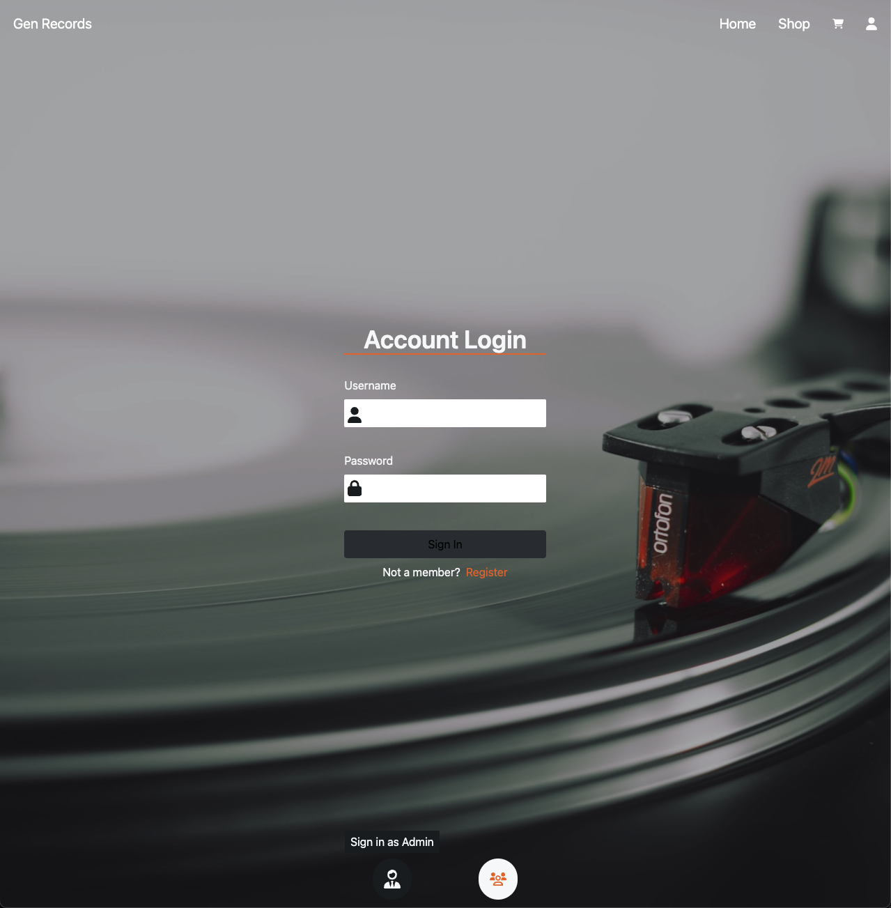
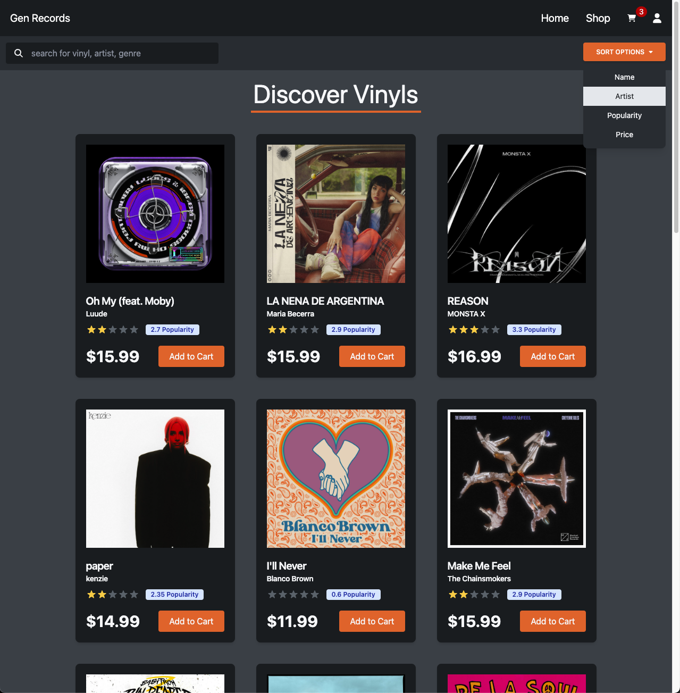
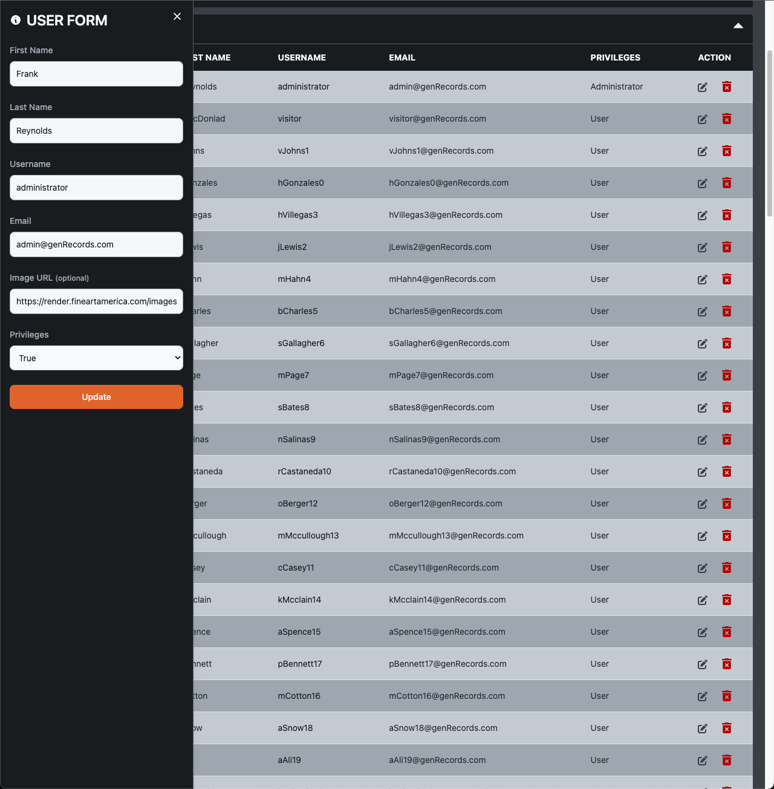
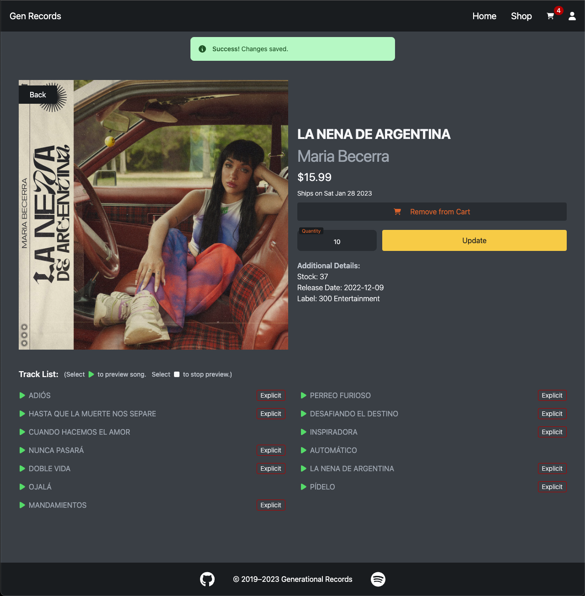

<!-- HEADER -->
<!-- https://i.imgur.com/ncCnsz4.png -->
<h1 align="center">
  <br/>
  🔗 <a href="https://gen-records.vercel.app/">Live Site</a>
</h1>

<!-- BRIEF DESCRIPTION -->
<p align="center">
Gen Records is an E-commerce website. It fetches album and artist data from Spotify's API to represent Vinyl Records. This website is equipped with user and administrator experiences.
</p>

<div align="center">

### Technology Used:


</div>

<br/>

<!-- TABLE OF CONTENTS -->
  <summary>
  <b>Table of Contents</b>
  </summary>
  <ol>
    <li>
      <a href="#features">Features</a>
    </li>
    <li>
      <a href="#api-reference">API Reference</a>
    </li>
    <li><a href="#contact">Contact</a></li>
    <li><a href="#screenshots">Screenshots</a></li>
  </ol>

  <br/>

# Features

## User Experiences:

- Add/Remove items from cart.
- User carts' persist and can be access across multiple devices for logged in users.
- User information is only accessible with proper credentials.
- Checkout system for guest and logged in users.
- Logged in users can view order history.
- View, sort, and search through inventory.
- Preview 30 second clips of music before purchasing. (if available)
- Responsive design.

## Admin Experiences:

- Access to Admin Dashboard.
- SPA experience with managed state.
- Protected routes for inventory CRUD operations.
- Protected routes for user CRUD operations.

# API Reference

### Login (Receive Token)

```
  POST /api/auth/login
```

| Header Parameter | Type               | Description                                           |
| :--------------- | :----------------- | :---------------------------------------------------- |
| `Content-Type`   | `application/json` | **Required**. User credentials. (Username & Password) |

<br/>

### Sign Up (Receive Token)

```
  POST /api/auth/signUp
```

| Header Parameter | Type               | Description                                                  |
| :--------------- | :----------------- | :----------------------------------------------------------- |
| `Content-Type`   | `application/json` | **Required**. User credentials. (Username, Email & Password) |

<br/>

### Public - Get all Vinyls

```
  GET /api/shop
```

<br/>

### Public - Get single Vinyl

```
  GET /api/shop/${vinylId}

  ex:
  GET /api/shop/18
  GET /api/shop/71
  ...
```

<br/>

### Administrator - Get all models

```
  GET /api/admin

  Models:
    artists
    lineItems
    orders
    tracks
    users
    vinyls
```

| Header Parameter | Type     | Description                                            |
| :--------------- | :------- | :----------------------------------------------------- |
| `authorization`  | `string` | **Required**. Valid jwt token with administrator role. |

<br/>

### Administrator - Create single item

```
  POST /api/admin/${modelName}

  ex:
  POST /api/admin/artists
  POST /api/admin/vinyls
  ...
```

| Header Parameter | Type     | Description                                            |
| :--------------- | :------- | :----------------------------------------------------- |
| `authorization`  | `string` | **Required**. Valid jwt token with administrator role. |

<br/>

### Administrator - Update single item

```
  PUT /api/admin/${modelName}/${id}

  ex:
  PUT /api/admin/lineItems/21
  PUT /api/admin/orders/24
  ...
```

| Header Parameter | Type     | Description                                            |
| :--------------- | :------- | :----------------------------------------------------- |
| `authorization`  | `string` | **Required**. Valid jwt token with administrator role. |

<br/>

### Administrator - Delete single item

```
  DELETE /api/admin/${modelName}/${id}

  ex:
  DELETE /api/admin/artists/21
  DELETE /api/admin/vinyls/24
  ...
```

| Header Parameter | Type     | Description                                            |
| :--------------- | :------- | :----------------------------------------------------- |
| `authorization`  | `string` | **Required**. Valid jwt token with administrator role. |

<br/>

# Contact

If you are interested in reporting any issues, would like to ask further questions about this project or would just like to connect, you may contact me directly at:

**Andrew Dobson**
| [linkedin.com/in/tandrewlopez](https://linkedin.com/in/tandrewlopez) | [github.com/TAndrewLopez](https://github.com/TAndrewLopez) |
<br/>
<br/>

# Screenshots

## Login Page



## Landing Page


## Discover Page



## Admin Edit Form



## Single View


