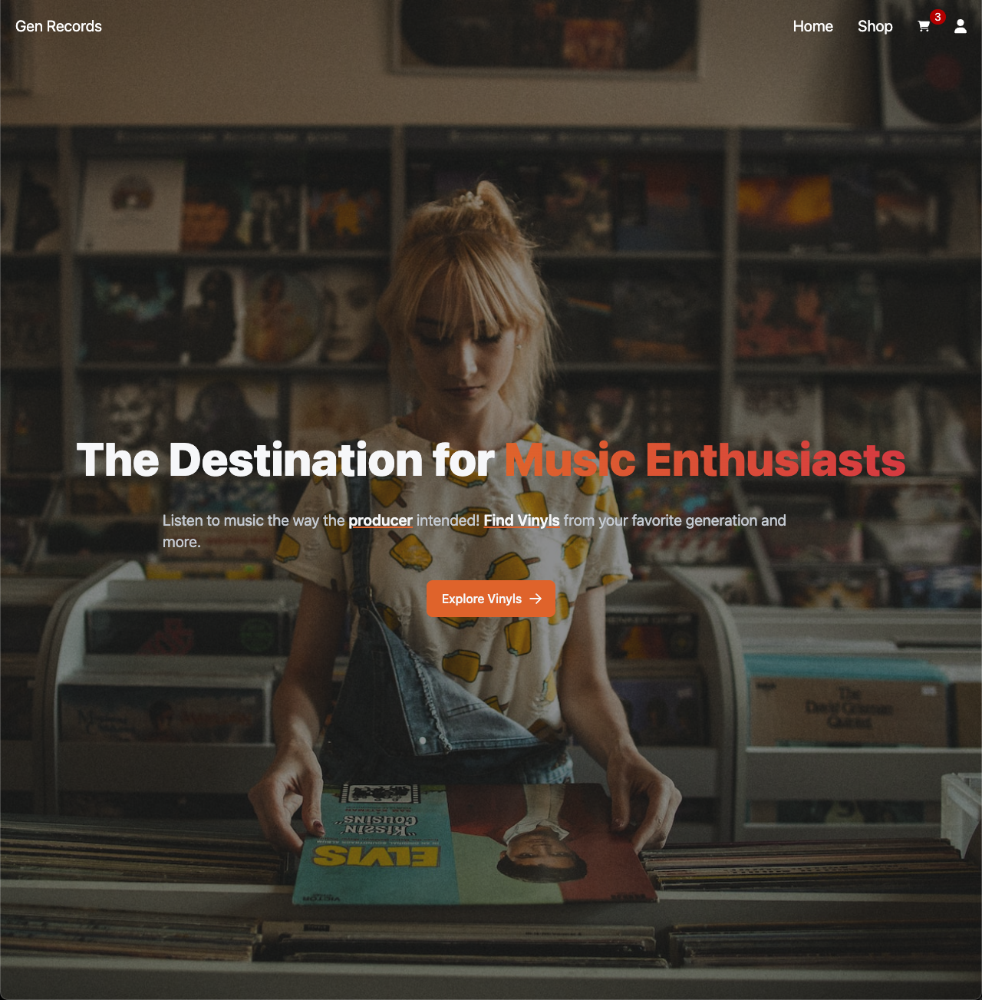

<!-- HEADER -->
<!-- https://i.imgur.com/ncCnsz4.png -->
<h1 align="center">
   
  <a href="https://gen-records.vercel.app/">🔗 Gen Records Live Site</a>
</h1>

<!-- BADGES -->

<!-- BRIEF DESCRIPTION -->

Gen Records is an E-commerce website. It fetches album and artist data from Spotify's API to represent Vinyl Records. This website is equipped with user and administrator experiences.

<!-- VIDEO LINK -->
<!-- 

<a href="https://youtu.be/GvZ8XhF3Jz4" alt="video-demonstration">
<b>📺 Video Demonstration</b>
</a>

 -->

<h3>Technology Used:<h3/>

## Features

- User Experiences:

  - Add/Remove items from cart.
  - User carts' persist and can be access across multiple devices for logged in users.
  - User information is only accessible with proper credentials.
  - Checkout system for guest and logged in users.
  - Logged in users can view order history.
  - View, sort, and search through inventory.
  - Preview 30 second clips of music before purchasing. (if available)
  - Responsive design.

- Admin Experiences:
  - Access to Admin Dashboard.
  - SPA experience with managed state.
  - Protected routes for inventory CRUD operations.
  - Protected routes for user CRUD operations.

### Contact

If you are interested in reporting any issues, would like to ask further questions about this project or would just like to connect, you may contact me directly at:

**Andrew Dobson**
| [linkedin.com/in/tandrewlopez](https://linkedin.com/in/tandrewlopez) | [github.com/TAndrewLopez](https://github.com/TAndrewLopez) |

## Screenshots

Landing Page

Discover Page

Single View

Profile Page

Login Page

Admin Form

Checkout Page

